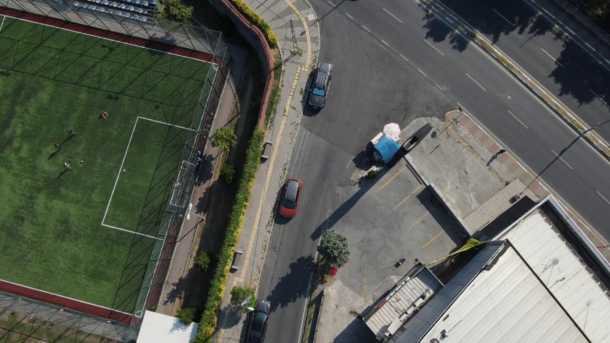

Cloud Grain Data Augmentation Tool
========================================

A lightweight Python tool for applying cloud-like atmospheric effects and film grain to images. Designed for batch processing with configurable parameters.

How It Works
------------

The tool processes images through a modular pipeline with two independent effect branches:

### Cloud Effect Pipeline

1. **Mask Generation** (`CreateMask.py`): Produces a procedural cloud alpha mask using gamma correction and noise-based cloud density simulation. The mask is saved as `Alpha_Mask.png` on first run and reused for subsequent images to ensure style consistency across a batch.

2. **Mask Processing** (`MaskScripts.py`): Adjusts the generated mask using the user-provided parameters:
   - `gamma_param` controls how dense the cloud coverage appears (gamma correction on the mask)
   - `alpha_multiplier` scales the mask's alpha channel intensity
   - `opacity_factor` sets the final blend strength when compositing the cloud overlay onto the original image

3. **Compositing**: The processed mask is blended with the input image using alpha blending, producing a cloud-covered output saved to `Outputs/Cloud/`.

### Grain Effect Pipeline

1. **Noise Generation** (`AddGrain.py`): Generates film-grain-style noise (likely Perlin or simplex noise via the `noise` library) scaled by `grain_intensity`.

2. **Blending**: The noise texture is overlaid onto the original image and saved to `Outputs/Grain/`.

### Batch Processing

`Controller.py` orchestrates the pipeline:
- Reads all images from `Inputs/`
- Applies both cloud and grain effects sequentially using the same parameter set
- Writes results to the respective `Outputs/` subdirectories
- Supports any image format readable by OpenCV (JPG, PNG, BMP, etc.)

Installation
----------

### Requirements

- Python 3.8+
- OpenCV
- NumPy
- Pillow
- noise
- matplotlib

### Setup

Upgrade pip and install dependencies:

    python -m pip install --upgrade pip
    pip install opencv-python numpy pillow noise matplotlib

**Windows users:** Some packages require a C++ compiler. If you encounter build errors, install Microsoft C++ Build Tools with the "Desktop development with C++" workload selected.

Project Structure
-----------------

    Project/
    ├── Inputs/              # Source images
    ├── Outputs/
    │   ├── Cloud/           # Cloud effect outputs
    │   └── Grain/           # Grain effect outputs
    ├── AddGrain.py          # Grain effect module
    ├── CreateMask.py        # Mask generation module
    ├── MaskScripts.py       # Mask processing utilities
    ├── ThermalConverter.py  # Thermal conversion module
    ├── Controller.py        # Main script
    ├── Alpha_Mask.png       # Generated automatically on first run
    ├── cloud1.jpg           # Example: cloud effect output
    ├── cloud3.jpg           # Example: cloud effect output
    ├── grain1.jpg           # Example: grain effect output
    ├── grain2.jpg           # Example: grain effect output
    └── README.md

Usage
-----

1. Place your images in the `Inputs/` directory.
2. Run the script from the project root:

    python Controller.py <alpha_multiplier> <gamma_param> <opacity_factor> <grain_intensity>

### Recommended Settings

    python Controller.py 0.8 2.0 0.9 0.7

Parameters
----------

| Parameter          | Description                                          | Range       |
|--------------------|------------------------------------------------------|-------------|
| `alpha_multiplier` | Scales the alpha channel of the cloud mask             | 0.3 to 1.5  |
| `gamma_param`      | Controls cloud density. Must be >= 1.0                 | 1.0 to 4.0  |
| `opacity_factor`   | Final opacity of the cloud overlay                     | 0.1 to 1.0  |
| `grain_intensity`  | Strength of the film grain effect                      | 0.0 to 1.5  |

Example Outputs
---------------

### Cloud Effect

### Grain Effect

Presets
-------

| Effect              | alpha_multiplier | gamma_param | opacity_factor | grain_intensity |
|---------------------|------------------|-------------|----------------|-----------------|
| Light haze          | 0.4              | 1.2         | 0.5            | 0.2             |
| Balanced (default)  | 0.8              | 2.0         | 0.9            | 0.7             |
| Heavy clouds        | 1.2              | 3.5         | 1.0            | 0.3             |
| Vintage film        | 0.6              | 1.5         | 0.7            | 1.2             |

For further assistance, contact: ysfmerttyldz@mail.com
